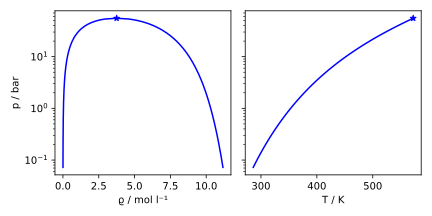
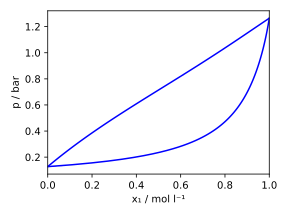

# pyclapeyron

Python wrapper for [Clapeyron.jl](https://clapeyronthermo.github.io/Clapeyron.jl/).

## Installation

Install `pyclapeyron` from PyPI:

```
pip install pyclapeyron
```

Import pyclapeyron as `import pyclapeyron as cl` (optional).

## Documentation

See the [Clapeyron.jl documentation](https://clapeyronthermo.github.io/Clapeyron.jl/stable/).

In general, `pyclapeyron` only acts as a wrapper around the Julia functions using the same syntax.
In the following, notable deviations from the Julia syntax are highlighted.

### Julia functions with `!`

Functions ending with `!` in Julia (often used for inplace operations) are renamed to end with `_b`, e.g. `fun!(...)` in Julia is `fun_b(...)` in Python.

### Manual type conversion

> [!NOTE]  
> These type conversions need further modifications of `Clapeyron.jl` and won't be necessary anymore soon.

In some (rare) cases, a manual type conversion is required before passing arguments to `pyclapeyron` functions.
For most of these type conversions, you need to load the `juliacall` package as `from juliacall import Main as jl`.

- Some keyword arguments need to be passed as Julia `Vector{String}` arrays by converting the Python list as `some_function(... userlocations=jl.Vector[jl.String](['file1.csv', 'file2.csv', ...]) ...)`.
   - `userlocations`
   - `ignore_missing_singleparams`
   - `asymmetricparams` 
- There is no direct equivalent to the Julia `Symbol` in Python. Thus, in case a `Symbol` needs to be passed to a function, it needs to be manually converted by `jl.Symbol('some_string')`.
- Some `Clapeyron.jl` require fully paramaterized variables, which is is hard to do from Python, e.g. `{"a": 1.0, "b": 2.0}` is converted to a `PyDict{Any, Any}` object while `Clapeyron.jl` is expecting a `Dict{String,Float64}` object. You can fix this by using `jl.concretize(...)`.
- Numeric arrays nested in data structures like dicts sometimes also need type conversion, e.g.
```python
model = cl.PR(["nitrogen"], userlocations={
    "Tc": jl.Array[jl.Float64]([0.3]),
    "Pc": jl.Array[jl.Float64]([1.]),
    "Mw": jl.Array[jl.Float64]([1.])
})
```

### Croup-contribution and electrolytes models 

The components for group contribution models that include the groups need to be passed in the form `("component name", {"group1": n1, ...}, ...)`, e.g.
```python
model = cl.CompositeModel(
    ["water", "ethanol", ("ibuprofen", {"ACH": 4, "ACCH2": 1, "ACCH": 1, "CH3": 3, "COOH": 1, "CH": 1})],
    liquid=cl.UNIFAC, solid=cl.SolidHfus
)
```
The dict replaces Julias' `Vector{Pair}` as there is no direct equivalent in Python.

Similarly, salts in electrolyte models need to be defined as `salts = (("sodium chloride", [("sodium", 1), ("chloride", 1)]),)`.

### Functions as function arguments

If you need to pass a `Clapeyron` function to another function, e.g. as in `partial_property`, you need to pass the original `Clapeyron.some_func` function, e.g. ```cl.partial_property(model, p, T, z, cl.Clapeyron.volume)```.

## Examples

- pure substance VLE

```python
import pyclapeyron as cl
import numpy as np
import matplotlib.pyplot as plt

model = cl.PCSAFT("benzene")
Tc, pc, vc = cl.crit_pure(model)

Tx = np.linspace(0.5*Tc, Tc, 100)
ps, vl, vv = np.zeros(100), np.zeros(100), np.zeros(100)
for (i,Ti) in enumerate(Tx):
    ps[i], vl[i], vv[i] = cl.saturation_pressure(model, Ti)

fig, axs = plt.subplots(nrows=1, ncols=2, sharey=True, figsize=(6,3))
axs[0].plot(1e-3/np.concat([vl,np.flip(vv)]), np.concat([ps,np.flip(ps)])/1e5, c="blue")
axs[1].plot(Tx, ps/1e5, c="red")
axs[0].scatter(1e-3/vc, pc/1e5, marker="*", c="blue")
axs[1].scatter(Tc, pc/1e5, marker="*", c="red")
axs[0].set_yscale("log")
axs[0].set_xlabel("ϱ / mol l⁻¹")
axs[1].set_xlabel("T / K")
axs[0].set_ylabel("p / bar")
plt.tight_layout()
```
<p align="center">
    
</p>

- mixture VLE

```python
import pyclapeyron as cl
import numpy as np
import matplotlib.pyplot as plt

antoine_pars = dict(        # calculated by the GRAPPA model (see https://ml-prop.mv.rptu.de/)
    A   = np.array([14.451,14.529])/np.log(10)-np.log10(101.325/760),
    B   = np.array([2516.535,3084.907])/np.log(10), 
    C   = np.array([-38.168,-42.557])+273.15,
    Tc  = np.array([461.,545.]),
    Pc  = np.array([64e5,48.7e5]), 
    Tmin= np.array([200.,200.]),
    Tmax= np.array([450.,450.])
)
sat = cl.AntoineEqSat(["acetaldehyde", "acetonitrile"], userlocations=antoine_pars)
model = cl.UNIFAC2(
    [("acetaldehyde", {"CH3": 1, "HCO": 1}), ("acetonitrile", {"CH3CN": 1}),], puremodel=sat
)

T_iso = 300.
x1 = np.linspace(0.,1.,100)
ps, y1 = np.zeros(100), np.zeros(100)
for (i,x1i) in enumerate(x1):
    ps[i], _, _, yi = cl.bubble_pressure(model, T_iso, np.array([x1i,1-x1i]))
    y1[i] = yi[0]

fig, ax = plt.subplots(figsize=(4,3))
ax.plot(x1, ps/1e5, c="blue")
ax.plot(y1, ps/1e5, c="blue")
ax.set_xlim((0,1))
ax.set_xlabel("x₁ / mol l⁻¹")
ax.set_ylabel("p / bar")
plt.tight_layout()
```
<p align="center">
    
</p>